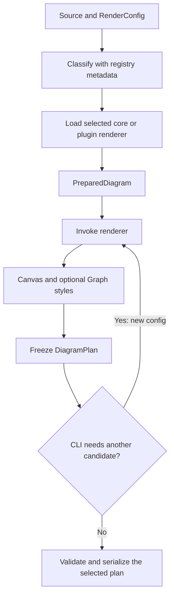

# Project architecture

[Project README](../README.md) · [Diagram examples](supported-diagrams.md) ·
[Plugin authoring](plugins.md) · [Editor integrations](integrations.md) ·
[Benchmarks](../benchmarks/README.md)

Termaid has one pipeline for core diagrams and bundled plugins. It resolves a
renderer once, builds independent layout candidates, and freezes terminal cells
into a `DiagramPlan`. Text, Rich, and styled JSON serialize that same plan.
Plain rendering has no third-party runtime dependencies.

## Ownership

```text
src/termaid/
├── __init__.py       # Public parse, plan, prepare and rendering API
├── pipeline.py       # PreparedDiagram: resolve once, render one candidate
├── source.py         # Preamble/header classification using registry metadata
├── registry.py       # Immutable descriptors, header aliases, lazy loaders
├── cli.py            # Arguments, terminal policy, input/output and diagnostics
├── core/
│   ├── graph.py      # Shared Graph, node/edge types, shapes and directions
│   ├── canvas.py     # Mutable Canvas and immutable DiagramPlan
│   └── contracts.py  # Source, options, render results, plugin contracts
├── diagrams/         # Core feature implementations
│   ├── flowchart.py
│   ├── state.py
│   ├── architecture.py
│   ├── classdiagram.py
│   ├── erdiagram.py
│   └── sequence/     # syntax.py owns events/parsing; render.py owns layout/drawing
├── plugins/          # Bundled optional families, enabled by default
│   ├── gitgraph.py
│   ├── packet.py
│   ├── blockdiagram.py
│   ├── charts.py     # Pie, quadrant and XY
│   ├── timelines.py  # Gantt and timeline
│   ├── boards.py     # Journey and kanban
│   └── trees.py      # Mindmap and treemap
├── layout/           # Shared placement, geometry, labels and fitting
├── routing/          # Shared graph ports, path search and route refinement
├── renderer/         # Shared graph drawing, shapes, character sets and themes
├── output/           # Frozen-plan serializers and optional widget
├── ingest.py         # JSON/tabular input → Mermaid
├── diagnostics.py    # Versioned diagnostic schema and presentation
└── utils.py          # Display-cell measurement and text wrapping
```

Small features own their model, parsing and rendering in the same module.
Related plugins share files where their responsibilities fit. Large features
can use a local package; sequence keeps its event syntax separate from drawing.
The registry calls the feature entry point directly. There is no strategy class
or global model/parser/renderer file triplet for each diagram type.

Flowchart, state and architecture share the `Graph` pipeline. Architecture stays
in core because its port hints and fixed grid positions already fit that model.
Sequence, class and ER remain core priorities with their own domain models and
layouts. Plugins use those shared algorithms when appropriate; every family
uses the same Canvas, result and serialization contracts.

## Public execution path



`plan(source, config)` calls `prepare(source).plan(config)` once. Existing keyword
rendering options are still supported. Use either a typed config or non-default
keyword options; mixing them raises an error. `render`, `render_rich`, and
`render_styled` are convenience calls around that one plan.

`parse_source()` recognizes exact header tokens after YAML frontmatter, comments
and directives. `ParsedSource.diagram_id` is an extensible string, `text` retains
directives, and `body` starts at the header. Git consumes `text`; other current
families consume `body`. `DiagramType` supplies convenience names for built-ins;
new plugins do not need an enum member. Unknown headers retain the permissive
flowchart fallback. Known but unavailable plugins fail explicitly.

`prepare()` stores classified source and a resolved renderer. The CLI reuses it
for fitting, so retries neither classify nor discover/load plugins again.
Family models are parsed independently per attempt; layout may mutate working
models, so models are not cached across candidates.

`parse()` remains the narrower Graph-returning API for flowchart and state
source. Use `plan()` or `render()` for other families.

## Contracts and extension points

- `RenderConfig` is immutable. Plugin dataclasses can inherit it to add typed
  fields. Fitting uses `dataclasses.replace`, preserving the subclass and fields.
- `Renderer` is the callable protocol `(ParsedSource, RenderConfig) → RenderResult`.
  A function is sufficient for simple features.
- `ConfiguredRenderer[Options]` supports inheritance when a feature needs typed
  settings. It translates plain common options onto feature defaults and rejects
  unrelated config types. Its `render()` override receives the concrete type.
- `RenderResult` contains a Canvas and optional Graph for custom style rules.
- `DiagramPlan` freezes cells and styles. Its serialization methods never lay out.
- `DiagramDefinition` declares an identifier, exact header aliases, contract
  version and lazy loader. `DiagramRegistry.register()` returns a new snapshot;
  duplicate identifiers/aliases are errors.
- `adapted_loader()` preserves the concrete type of a backend and converts its
  native protocol to the supported renderer contract. Native protocol metadata
  does not bypass contract validation. Unadapted unsupported versions fail.

A registry is passed explicitly to classification/planning, with all existing
families present in `DEFAULT_REGISTRY`. Descriptor metadata is available before
implementation imports. Only the selected family loads. Registry extension does
not change existing prepared operations. External package discovery is not
implemented; [explicit registration](plugins.md) is the extension mechanism.

## Graph workflow

```text
parse Graph → place and size → route and orient → paint geometry
            → place labels against occupied cells → freeze DiagramPlan
```

`layout/graph_plan.py` creates a working copy of Graph, calls `grid.compute_layout`
and `routing.route_edges`, then applies orientation transforms. `GraphPlan` holds
boxes, routes and dimensions before painting; `DiagramPlan` holds final cells.

Within graph layout, `layers.py` assigns and orders ranks, `placement.py` measures
and places nodes, and `geometry.py` computes frames and drawing coordinates.
`renderer/graph.py` paints backgrounds, nodes, routes, headings and notes before
placing edge labels against occupied cells. Unplaceable labels retain their full
text in numbered references. `layout/labels.py` also serves sequence layouts.

Subgraphs are measured frames around their member nodes. Routes respect unrelated
frames and headings, and group endpoints attach to their borders. Routing
refinements remain ordered; changing that order is an algorithm change.

## Fitting and output

`layout/fitting.py` accepts an initial plan, a typed candidate callback,
`RenderConfig`, and `FitOptions`. It returns `FitResult(plan, score, attempts)`.
It reads no terminal state and emits no messages. The CLI owns terminal-width
selection, warnings, hard constraints, and file writes.

Compact mode changes spacing. Wrap mode explores label budgets; reflow may also
try vertical graph layout. Quality scores compare overflow, reference fallback,
label budget and height. The limit remains eight attempts including the initial
plan. Fitting is bounded heuristic search, not a guarantee of an optimal layout.

Output constraints are checked before opening an output file. Text and styled
JSON trim trailing whitespace; Rich retains section-background spaces where
needed. Graph custom styles and family backgrounds use one Rich serialization
loop with explicit style policies. Rich and Textual remain optional and lazy.

## Dependency rules and maintenance

Core definitions do not import feature implementations, dispatch or the CLI.
Layout/routing/shared drawing do not import plugins or the public package facade.
Features import contracts and shared algorithms. Serializers consume cells/plans;
only the widget uses the public rendering API to request a new layout.
`DiagramPlan.to_rich()` and `to_styled()` lazily call serializers as convenience
methods. A documented `output.styled.render_styled` re-export is retained at the
old public path; production rendering uses the package API.

Old internal `model/`, `parser/`, `graph/`, per-family `renderer/`,
`layout.engine`, and `layout.scene` import paths were removed. Import Graph,
Canvas and contracts from `core/`, family functions from their feature home,
and `plan` from `termaid` or `pipeline`. Public package functions, CLI flags and
version-1 output schemas retain their behavior.

Tests cover every family, renderer reuse, typed config inheritance, protocol
adapters, plugin isolation, lazy imports, fitting limits, serializer parity,
route/label geometry, and dependency boundaries. Run pytest, compileall, and
diff checks. No static checker or linter is configured; the binding audit uses
AST inspection and reports parameter reassignment in the source tree.

See [Contributing](../CONTRIBUTING.md) for feature changes and the commands;
[benchmarks](../benchmarks/README.md) preserve performance and layout evidence.
