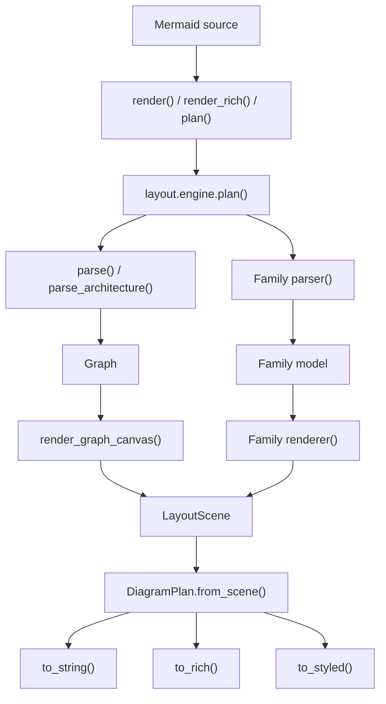

# Project architecture

[Project README](../README.md) · [Usage](../README.md#cli-options) · [Supported Mermaid definitions](supported-diagrams.md) · [Rendering details](#rendering-architecture)

Termaid is a pure Python pipeline from Mermaid source to terminal cells.
All 18 diagram types pass through `layout.engine.plan()`, share a `LayoutScene`, and produce an immutable `DiagramPlan`.
Text, Rich, and styled JSON reuse that plan.
Rich and Textual are optional consumers; the core pipeline has no runtime dependencies.

## End-to-end flow

The CLI reads files or stdin and optionally converts JSON/tabular data into Mermaid with `ingest.py`.
Python callers supply Mermaid directly.
The Textual widget calls the public `render()` function when it renders its source.



Arrows show the call path and the model or scene returned at each boundary.
`termaid.render()` calls `layout.engine.plan(...).to_string()`;
`termaid.render_rich()` calls `plan(...).to_rich()`.
The CLI and `output.styled.render_styled()` also call `plan()`.

Inside `layout.engine.plan()`, an `if`/`elif` chain checks the source header,
calls one parser, calls its renderer, and finally calls
`DiagramPlan.from_scene(canvas, graph=style_graph, max_width=max_width)`.
There is currently no separate registry or handler class for diagram dispatch.

For flowcharts and state diagrams, the default branch calls `termaid.parse()`,
which chooses `parse_flowchart()` or `parse_state_diagram()` and returns a
`graph.model.Graph`. Architecture diagrams call `parse_architecture()` directly
and also return `Graph`. All three call `renderer.draw.render_graph_canvas()`.
Inside that function, `layout.graph_plan.plan_graph()` calls
`compute_layout()` and `route_edges()` to build a `GraphPlan` containing boxes,
routes, and bounds before drawing cells into a `LayoutScene`.

Other families call their own parser and renderer directly from `plan()`.
For example, `parse_sequence_diagram()` returns a `SequenceDiagram`, then
`render_sequence()` lays out lifelines and events in a `LayoutScene`.
Class diagrams, charts, grids, and timelines likewise keep their own layout
rules; their parser and renderer functions are listed below.

`termaid.parse()` is a narrower API: it returns a `Graph` for flowcharts and
state diagrams. Use `termaid.plan()` or `termaid.render()` to dispatch all families.
`render()` and `render_rich()` each create a plan; call `plan()` yourself when
you want to serialize one layout into multiple formats.

### Worked graph example

Mermaid source:

```text
flowchart LR
  User --> API
  subgraph Backend [Backend]
    API --> Worker
  end
  Worker --> DB
```

Current plain-text output with default options:

```text
              ┌───────────────────────────┐
              │ Backend                   │
              │                           │
              │                           │
              │                           │
┌────────┐    │ ┌───────┐    ┌──────────┐ │    ┌──────┐
│        │    │ │       │    │          │ │    │      │
│  User  ├────┼─▶  API  ├────▶  Worker  ├─┼────▶  DB  │
│        │    │ │       │    │          │ │    │      │
└────────┘    │ └───────┘    └──────────┘ │    └──────┘
              │                           │
              └───────────────────────────┘
```

For this source, `termaid.parse()` calls `parse_flowchart()` and returns a
`Graph` with direction `LR`, four nodes (`User`, `API`, `Worker`, `DB`), three
edges, and one `Subgraph` named `Backend`. Its `node_ids` are `API` and
`Worker`; `User` and `DB` remain outside the group.

The current call chain for `termaid.render(source)` is:

```text
termaid.render(source)
├─ layout.engine.plan(source)
│  ├─ _strip_frontmatter(source.strip())
│  ├─ termaid.parse(text)
│  │  └─ parser.flowchart.parse_flowchart(text)
│  │     └─ _FlowchartParser.parse() → Graph
│  ├─ renderer.draw.render_graph_canvas(graph)
│  │  ├─ layout.graph_plan.plan_graph(graph) → GraphPlan
│  │  │  ├─ deepcopy(graph)
│  │  │  ├─ layout.grid.compute_layout(copy) → GridLayout
│  │  │  │  ├─ assign_layers() / order_layers() / place_nodes() / compute_sizes()
│  │  │  │  ├─ expand_gaps_for_subgraphs()
│  │  │  │  └─ compute_subgraph_bounds()
│  │  │  └─ routing.router.route_edges(copy, layout) → routes
│  │  ├─ LayoutScene(width, height)
│  │  ├─ _draw_subgraph_borders() → _draw_nodes() → _draw_edges()
│  │  ├─ _draw_subgraph_labels() → _draw_notes() → _draw_edge_labels()
│  │  └─ returns LayoutScene
│  └─ DiagramPlan.from_scene(canvas, graph=style_graph) → DiagramPlan
└─ DiagramPlan.to_string() → str
```

The tree omits intermediate layout helpers. `GraphPlan` contains the copied
graph, `GridLayout`, routes, and overall size; `DiagramPlan` freezes the
painted cells and graph style rules. A caller that invokes `plan()` directly
can serialize that one plan through `to_string()`, `to_rich()`, or `to_styled()`.

The graph has two distinct layout results: `GraphPlan` holds positions and
routes before painting, while `DiagramPlan` holds completed terminal cells
after painting. Neither parser draws cells.

### How a flowchart subgraph is drawn

`_FlowchartParser` maintains a stack of open groups. On `subgraph`, it creates
a `Subgraph`; node declarations inside it add IDs to `node_ids`; `end` closes
the current group. Nested groups become `children`. A connection that names a
subgraph ID is marked as a group endpoint during parser post-processing.

`compute_layout()` first places and measures nodes. It then calls
`expand_gaps_for_subgraphs()` to reserve room for frames and titles, and
`compute_subgraph_bounds()` to enclose the member node boxes and nested group
bounds. The calculated `SubgraphBounds` includes border padding and title
height. `route_edges()` treats unrelated groups as obstacles, permits edges
attached to a group's members to cross its frame, and snaps explicit group
endpoints to the frame border. Group headings are kept clear of routes.

Finally, `_draw_subgraph_borders()` writes the frame's top, bottom, and sides
into the shared `LayoutScene` using `CharSet.sg_*` characters and the
`subgraph` style. Node shapes and connections are painted afterward;
`_draw_subgraph_labels()` writes the heading with the `subgraph_label` style.
The subgraph is a measured frame around nodes, not an ordinary graph node or a
separate canvas.

## Source map

Paths below are relative to [`src/termaid/`](../src/termaid/).

| Component | Responsibility |
| --- | --- |
| [`__init__.py`](../src/termaid/__init__.py) | Public `parse`, `plan`, `render`, `render_rich`, and lazy `MermaidWidget` access |
| [`cli.py`](../src/termaid/cli.py) | Input handling, options, fitting loop, constraint checks, output selection, and process status |
| [`ingest.py`](../src/termaid/ingest.py) | Convert supported JSON/tabular input to Mermaid |
| [`parser/`](../src/termaid/parser/) | Convert Mermaid syntax into graph or family models |
| [`graph/`](../src/termaid/graph/) | Shared nodes, edges, subgraphs, directions, and shapes |
| [`model/`](../src/termaid/model/) | Family-specific data structures |
| [`layout/engine.py`](../src/termaid/layout/engine.py) | Family dispatch and immutable `DiagramPlan` |
| [`layout/grid.py`](../src/termaid/layout/grid.py) | Graph layout orchestration using `layers.py`, `placement.py`, and `geometry.py` |
| [`layout/graph_plan.py`](../src/termaid/layout/graph_plan.py) | Combine node placement, routes, bounds, and orientation transforms |
| [`routing/`](../src/termaid/routing/) | Port selection and orthogonal edge routing with A* pathfinding |
| [`layout/labels.py`](../src/termaid/layout/labels.py) | Measure, reserve, and validate text placement |
| [`layout/scene.py`](../src/termaid/layout/scene.py) | Shared cell occupancy, geometry merging, and semantic styles |
| [`layout/fitting.py`](../src/termaid/layout/fitting.py) | Score candidates visited by the CLI fitting loop |
| [`renderer/`](../src/termaid/renderer/) | Family rendering, graph drawing, shapes, character sets, and themes |
| [`output/`](../src/termaid/output/) | Text and Rich adapters, styled serialization, and Textual widget |
| [`diagnostics.py`](../src/termaid/diagnostics.py) | CLI errors and warnings as text or versioned JSON |
| [`utils.py`](../src/termaid/utils.py) | Display-cell measurement and text wrapping |

## Diagram families

Related families use matching module names under `parser/`, `model/`, and `renderer/`.
The graph families share `graph/model.py` and `renderer/draw.py`.

```mermaid
flowchart TB
  all[18 supported types] --> graph[Shared Graph model]
  all --> family[Family-specific models]
  graph --> graph_types[Flowchart / State / Architecture]
  family --> relation[Class / ER]
  family --> sequence[Sequence]
  family --> structured[Block / Git / Gantt / Timeline / Journey / Kanban / Packet]
  family --> charts[Pie / Quadrant / XY]
  family --> trees[Mindmap / Treemap]
```

The family branches organize diagram semantics. Each type currently calls its
own renderer function, even when several types share a Python module. The
three `Graph` types share one model and `render_graph_canvas()`.

| Diagram type | Parser call | Model class | Renderer call |
| --- | --- | --- | --- |
| Flowchart | `parse_flowchart()` | `Graph` | `render_graph_canvas()` |
| State | `parse_state_diagram()` | `Graph` | `render_graph_canvas()` |
| Architecture | `parse_architecture()` | `Graph` | `render_graph_canvas()` |
| Sequence | `parse_sequence_diagram()` | `SequenceDiagram` | `render_sequence()` |
| Class | `parse_class_diagram()` | `ClassDiagram` | `render_class_diagram()` |
| ER | `parse_er_diagram()` | `ERDiagram` | `render_er_diagram()` |
| Block | `parse_block_diagram()` | `BlockDiagram` | `render_block_diagram()` |
| Git | `parse_git_graph()` | `GitGraph` | `render_git_graph()` |
| Packet | `parse_packet()` | `Packet` | `render_packet()` |
| Pie | `parse_pie_chart()` | `PieChart` | `render_pie_chart()` |
| Quadrant | `parse_quadrant()` | `QuadrantChart` | `render_quadrant()` |
| XY chart | `parse_xychart()` | `XYChart` | `render_xychart()` |
| Mindmap | `parse_mindmap()` | `Mindmap` | `render_mindmap()` |
| Treemap | `parse_treemap()` | `Treemap` | `render_treemap()` |
| User journey | `parse_journey()` | `Journey` | `render_journey()` |
| Kanban | `parse_kanban()` | `Kanban` | `render_kanban()` |
| Gantt | `parse_gantt()` | `Gantt` | `render_gantt()` |
| Timeline | `parse_timeline()` | `Timeline` | `render_timeline()` |

### Features and current rendering work

This inventory describes the content each parser retains and the layout each
renderer actually performs. Sharing a parser/renderer *module* does not mean
sharing a layout algorithm.

| Type | Essential model features | Current layout and painting work |
| --- | --- | --- |
| Flowchart | Directed nodes and edges, shapes, labels, styles, nested subgraphs | Rank and order nodes, size boxes, reserve group frames, route orthogonal edges, then draw shapes, connections, and labels through `render_graph_canvas()`. |
| State | States, transitions, start/end markers, composite states, stereotypes | Translate state syntax into `Graph` nodes, edges, and shapes; use the same graph placement, routing, and drawing path as flowcharts. |
| Architecture | Services, groups, junctions, directional connections, declared grid positions | Parse into `Graph` with `grid_positions`; place nodes from those positions, then use shared graph sizing, routing, and drawing. |
| Sequence | Participants, messages, notes, activations, blocks, destruction events | Measure participant columns and event rows, draw headers and lifelines, then messages, scopes, notes, and reserved labels. |
| Class | Classes, attributes, methods, relation markers, cardinalities, notes | Assign relation layers, size compartment boxes, place notes, route relationships, then paint connections, boxes, and notes. |
| ER | Entities, typed attributes and keys, relation cardinalities | Assign relation layers, size entity boxes, reserve room for labels/cardinalities, then paint connections and entity compartments. |
| Block | Explicit columns, spans, nested blocks, shapes, links | Fill a grid, measure rows/columns and nested blocks, then draw group borders, links, and block shapes. |
| Git | Branches, commits, parents, merges, tags, commit types | Compute branch lanes and commit coordinates for LR/TB/BT, then draw branch lines, connections, commit markers, and labels. |
| Gantt | Dated tasks, sections, progress states, milestones, markers | Map dates to chart columns and tasks to rows, then draw bars/milestones, date axis, and markers. |
| Timeline | Sections, ordered events, detail lines | Compose styled rows around one vertical spine, then write those rows into a scene. |
| Journey | Sections, tasks, scores, actors | Measure task boxes along a horizontal path, draw section frames, actor markers, task connectors, and score faces. |
| Kanban | Columns, cards, metadata | Size columns from titles and cards, then draw column frames and stacked card boxes. |
| Packet | Bit ranges, field labels, row bit width | Convert bit offsets into fixed-width columns and rows, then draw field boundaries, bit numbers, labels, and overflow legend. |
| Pie | Labeled numeric slices, title, optional raw values | Convert fractions into a stacked bar and per-slice bars, then draw labels and percentages. |
| Quadrant | Normalized `(x, y)` points, axis and quadrant labels | Draw the four-quadrant grid, map points to cells, and place point labels. |
| XY chart | Categories or numeric ranges, bar/line datasets, horizontal mode | Choose numeric scales and axis cells, then draw bars or line paths, ticks, and labels. |
| Mindmap | Rooted, indented hierarchy | Recursively build branch text blocks, optionally split crowded roots left/right, then write rows into a scene. |
| Treemap | Nested nodes with values | Compute proportional nested rectangles, then draw section/leaf borders, labels, and values. |

### Reuse boundaries for a renderer hierarchy

The current shared rendering substrate is `LayoutScene` for cells and styles,
`CharSet` for many Unicode/ASCII glyph choices, `renderer/shapes/` for graph
and block node shapes, and `LabelPlan` for graph and sequence label
reservations. `DiagramPlan` is the common completed output. These components
already let specialized algorithms produce the same output type.

A future `Renderer[Model]` contract could expose
`render(model, options) -> LayoutScene`. One `GraphRenderer` could own the
existing `plan_graph()` and `render_graph_canvas()` path for flowchart, state,
and architecture models. A `LayeredBoxRenderer` could share class/ER layer
placement, box frames, and simple relationship lines, with separate hooks for
members versus entity attributes, markers versus cardinalities, and class
notes. Those two renderers have similar code today, but different semantics.

```text
Renderer[Model]                          proposed interface only
├─ GraphRenderer[Graph]                 shared graph pipeline
├─ LayeredBoxRenderer[Model]            shared layer/box template
│  ├─ ClassRenderer                     class-specific contents and relations
│  └─ ERRenderer                        entity attributes and cardinalities
└─ Other family renderers               independent layout implementations
```

Sequence, block, git, charts, trees, boards, timelines, and packet renderers
would implement the contract using their current algorithms. A universal base
implementation of measurement or placement would add branches for unrelated
rules. Reusable drawing operations, such as frames or simple orthogonal
segments, belong in small helpers when their collision and style behavior is
identical across callers.

This is a proposed interface, not a description of classes already in the
code. The existing public `render_*()` functions can remain wrappers while an
internal interface is introduced. Diagram dispatch can later map a type to a
parser, renderer, and option adapter; `DiagramPlan.from_scene()` remains the
shared boundary for text, Rich, and styled output.

## Shared boundaries

- **Models retain meaning.** Parsers capture diagram content. Graph planning and
  sequence rendering copy their input models before making layout changes.
- **Scenes hold mutable cells.** Geometry and semantic styles accumulate in
  `LayoutScene`. Graph and sequence labels use shared reservation and validation
  before committing text. `renderer.canvas.Canvas` is a compatibility alias.
- **Plans serve different stages.** `GraphPlan` is an internal, mutable graph
  layout result with boxes and routes. `DiagramPlan.from_scene()` freezes the
  completed `LayoutScene` into immutable cell rows and style rules, with
  dimensions and width overflow measured in terminal cells. `DiagramPlan` is
  the public output plan for every diagram type.
- **Adapters serialize.** Once a `DiagramPlan` exists, `to_string()`, `to_rich()`,
  and `to_styled()` do not parse source or rerun layout.
- **The CLI owns fitting.** `max_width` informs planning and label placement;
  it does not guarantee a fit. The CLI builds and scores bounded candidates,
  checks the selected result, and then emits output. See
  [bounded width fitting](#bounded-width-fitting).

## Working on a component

For geometry or label changes, read [rendering contracts](#rendering-architecture) and
review the [layout quality corpus](#reviewing-terminal-layout-quality). For an editor consumer,
read the [integration protocol](#editor-and-subprocess-integrations). For runtime changes, use the
[performance benchmarks](#reproduce).

[Contributing](../CONTRIBUTING.md) covers adding diagram types, shapes, and
fixtures. Tests live in [`tests/`](../tests/); benchmark drivers and recorded
measurements live in [`benchmarks/`](../benchmarks/).


## Rendering architecture

All 18 diagram types enter through `layout.engine.plan`. Specialized strategies
retain their domain rules, including sequence lifelines, chart scales, and layered
graph placement. They resolve geometry on the shared `layout.scene.LayoutScene`,
then freeze terminal cells and semantic styles into an immutable `DiagramPlan`.
Output adapters only serialize that plan; they do not parse or rerun layout.
`renderer.canvas.Canvas` remains a compatibility alias for the shared surface.
The CLI also fits and validates `DiagramPlan` candidates directly. Text, Rich,
and styled JSON share the same candidate sequence, and only the selected plan
is serialized. Color and JSON chunk construction do not run for rejected fits.

The source keeps parsing, layout, and rendering as separate responsibilities.
Small diagram implementations are grouped into `charts`, `trees`, `boards`, and
`timelines` modules within `model/`, `parser/`, and `renderer/`. Subgraph bounds
and drawing-coordinate conversion live together in `layout/geometry.py`.
See the [source map](#source-map) for where to start reading.

### Pipeline

1. Parse source into the existing diagram model.
2. Copy graph or sequence models at the renderer boundary, preserving original
   text and direction for repeated renders.
3. Measure nodes, participant columns, frames, routes, and label regions.
4. Reserve labels against geometry and previously reserved labels.
5. Validate the complete label batch, then paint it.
6. Freeze geometry and custom style rules into `DiagramPlan`.
7. Serialize the same plan as text, Rich output, or version 1 styled JSON.

`layout.labels.TextPlacement` records an owner, row, column, measured lines, and
semantic style. Its coordinates use terminal display cells. `LabelPlan` reads a
geometry surface and reserves occupied cells without painting text. Rejected
placements write nothing. Before painting, the plan checks all labels again so
late geometry changes cannot leave a partially written batch.

Protected cells include node interiors, not just visible border characters.
Reserved text includes spaces and the second cell of wide characters. Explicit
inline graph labels retain their existing permission to occupy straight line
segments; ordinary labels cannot occupy connectors, arrowheads, or other text.

### Graph layouts

`layout.graph_plan.plan_graph` computes boxes, ports, and orthogonal routes before
placing their cells. BT and RL transform geometry before text is placed, keeping
labels readable and multiline text in its original order.

#### Correctness and layout preferences

Hard constraints are complete graph content, orthogonal routes, intact node
interiors and group membership, visible edge direction, and labels that do not
overwrite geometry. `--strict-width` additionally requires the final output to
fit the requested terminal columns. An impossible route raises `RoutingError`;
an infeasible width is reported rather than silently clipped.

Rank, alignment, ports, shared trunks, label rows, and the number of visible
arrowheads are layout choices. Two arrivals may share one head at a common port
or use separate heads on different faces. Neither arrangement is mandatory.
One edge label per route must remain readable, inline or through a reference.
Identical declarations can share geometry without removing model edges.

#### Terminal layout strategy

1. **Rank dependencies.** Ungrouped acyclic graphs retain every declared forward
   dependency and minimum edge length. A direct root-to-sink shortcut cannot
   pull the sink above its other predecessors. Bidirectional arrowheads do not
   add a reverse ranking dependency. Cyclic and compound graphs retain their
   bounded discovery-tree and group-separation policies.
2. **Order peers.** Barycenter ordering and bounded adjacent swaps reduce
   crossings while preserving group membership. Nodes on one rank share a row
   in TB/BT or a column in LR/RL.
3. **Align within the grid.** A solitary hub can align with the median existing
   peer column/row. This does not introduce an extra wide text column to achieve
   browser-style symmetry. Feedback and compound layouts keep their established
   corridors; `uniform_nodes` remains an explicit sizing choice.
4. **Reserve routing space.** Compatible solid fan-out edges, including
   bidirectional edges with matching endpoint types, may share a bus. Adjacent
   ungrouped siblings reserve a bus lane rather than one lane per destination.
   At least separate turn and approach cells remain available in compact output.
   Reciprocal nodes with a clear corridor can use facing ports without an outer
   return margin. Returns around intervening nodes keep their reserved lane.
5. **Choose routes.** All orientations consider preplanned sibling buses and
   congestion when comparing node faces. Opposing and unrelated collinear
   traffic cost more. Node borders, group headings, and foreign frames constrain
   routing. Return connections prefer outer corridors when available.
   A final pass for ungrouped rectangular nodes can shift a line to a clear
   parallel port to remove tiny consecutive corners. It can spend a small outer
   margin to eliminate multiple intersections; width fitting measures that
   margin too. A late turn is considered when another edge already approaches
   the same target along the flow axis, not as a rule for all long connections.
   Shared fan-out buses retain their early branching geometry.
   A nearby turn may shift a few cells to expose a labeled branch's approach,
   provided it adds no connector contacts, node overlap, or tiny segments.
6. **Place text.** Branch labels prefer exclusive sections of their routes.
   Available terminal cells determine wrapping; numbered references preserve
   text that cannot fit. References follow source-edge order and identify the
   endpoints when their marker is ambiguous. No label or reference may erase
   an arrowhead or an unconnected crossing.

`x` marks unconnected crossings. Shared prefixes/suffixes attached to a common
endpoint may form junctions, but sharing an endpoint does not make every later
intersection connected. Default triangle heads occupy straight border cells;
shape-specific markers may require a nearby fallback head. BT/RL transform
geometry before labels are placed, preserving readable text.

The staged approach draws on [Dagre](https://github.com/dagrejs/dagre/wiki) and
[ELK Layered](https://eclipse.dev/elk/reference/algorithms/org-eclipse-elk-layered.html).
Termaid uses its own Python cell-grid implementation; neither engine is a runtime
dependency. Browser layouts guide topology and grouping, not pixel coordinates,
curves, unrestricted margins, or exact port counts. Fewer crossings may cost more
rows, so terminal width, labels, and total footprint must be reviewed together.

See [the layout review corpus](#reviewing-terminal-layout-quality) for classic samples, Mermaid
Live links, terminal-width measurements, and known limits of these heuristics.

### Sequence layouts

`SequenceLayout` records participant columns, box sizes, frame bounds, event
rows, and owned message-label placements. Original message text is retained
separately from provisional text used to measure horizontal spacing.

For a message spanning multiple participants, candidate label regions are the
gaps between consecutive lifelines along its arrow. The planner chooses the gap
requiring the fewest text rows, then the one closest to the sender. Self-message
labels use their own clear region, independently of the loop stroke. Loop reach
is capped at 15% of the measured canvas width, with a minimum allocation of ten cells
(eight visible cells plus the two-cell lifeline offset). The minimum takes priority
in narrow diagrams; short labels can use smaller loops within that range. Long labels can extend
beyond the loop while staying clear of the next lifeline. Final text height is measured before event rows
are assigned, so labels and horizontal arrows cannot share a row.

Geometry is painted before the shared label batch is validated and committed.
Intermediate arrow/lifeline crossings still use `x`. Message labels cannot mask
lifelines. Notes and scope headings retain their explicit overlay behavior.

### Bounded width fitting

The CLI compares visited candidates in this order:

1. Width overflow.
2. Height overflow when `--max-height` is supplied.
3. Number of label-reference entries.
4. Larger node-label budget.
5. Smaller output height and width.

Compact mode retains its three-render limit. Wrap/reflow fitting uses the
initial render and at most six label-budget candidates. One final render can
try more routing space if graph labels still require references, or vertical
reflow if the requested bounds remain unmet. Total renderer calls stay at most
eight. This is a bounded heuristic search, not a guarantee of the globally best
layout. A width budget is a maximum, not a requirement to stretch the drawing.

Gantt, packet, pie, quadrant, XY, and treemap layouts use the requested width
when choosing chart axes, bar lengths, bit columns, and surplus box space.
Packet rows shrink at bit boundaries. If labels or structural boxes still
require more columns, `--strict-width` reports the measured overflow without
emitting clipped output.

Horizontal graph layouts use the budget during geometry planning as well as
label placement. Each node retains complete whitespace-delimited words, so the
trial label width cannot split identifiers such as `MasterService` or `NOF_SSD`.
Long edge sentences reserve their longest word's width rather than their entire
length in the first gap. Busy transitions reserve distinct routing columns;
group transitions keep those columns off frame borders. Incoming connections
also reserve separated ports before routes are chosen.

After measuring nodes and nested frames, one optional allocation pass spends
remaining width on complete short labels in their destination corridors. This
does not enlarge every gap. Vertical reciprocal transitions can use spare width
to separate opposing ports and fit labels between them, while retaining a margin
for outer return labels. This bounded allocation applies only with a width budget.
Routing considers already planned sibling buses,
keeps labeled approaches available, and compares congestion when selecting an
alternate face. A blocked label reservation is relaxed once rather than losing
the edge. All ordinary node obstacles and directional costs remain active.

A label may extend beyond a short exclusive branch when its rectangle and its
approach to that branch are clear. It cannot cross another connector, overwrite
a border, or exceed the width budget. A single exclusive straight cell can anchor
a label; context cells must not let it borrow a shared trunk. This applies to
vertical and horizontal segments. Numbered references remain the fallback.
In `wrap` mode, an infeasible horizontal layout reports width overflow instead
of forcing identifiers into arbitrary fragments; `--strict-width` rejects it.
The optional vertical `reflow` attempt uses the available text width instead of
a fixed five-character limit. For ungrouped graphs with ordinary node sizing,
measured columns are narrowed before routing when they exceed that width.
Labels wrap from their source text while routing gaps and endpoint-port space
remain reserved. Compound, explicitly positioned, and uniform-node layouts keep
their existing sizing policies.

Performance and historical width-allocation measurements live in
[rendering performance](#rendering-performance) and [benchmarks/results](../benchmarks/results/).
Consumer configuration belongs in [editor and subprocess integrations](#editor-and-subprocess-integrations).

### Validation

The classic corpus checks all four flow directions, ASCII/Unicode, topology,
route clearance, complete text, and 80/120/160-column fitting. Regression tests
cover compound frames, feedback, labels, CJK/emoji cells, serializer parity, and
bounded fitting retries. Snapshots document reviewed output, but exact arrowhead
counts, arrival faces, and footnote identities are not correctness contracts.

Run `python -m pytest tests/ -q` and `python -m compileall -q src tests`.
No static type checker or linter is configured in the repository. Changes to
layout boundaries also require an AST-assisted parameter-rebinding audit.


## Editor and subprocess integrations

Use styled JSON for rendered content and JSON diagnostics for errors:

```sh
termaid --format styled-json --diagnostics-format json \
  --width 120 --strict-width --fit-mode reflow --max-height 4096
```

Pass Mermaid source on stdin. Stdout contains the existing version-1 styled
document on success. Stderr contains one JSON object per line for each diagnostic;
parse each line separately. Ordinary successful renders produce no diagnostics.
The default diagnostic format remains human-readable text.

For example, a diagram that cannot fit the requested width reports:

```json
{"version":1,"severity":"error","code":"width_exceeded","message":"diagram is 146 cols wide but target is 120. Try: less -S, or use 'graph TD' for vertical layout.","details":{"actual_width":146,"max_width":120},"exit_code":2}
```

The process exits with code 2 and emits no rendered content.
Render failures and constraint failures are checked before opening an `--output` file, preserving any previous output.
An output I/O failure can still leave a partially written file.

### Diagnostic contract, version 1

| Field | Meaning |
| --- | --- |
| `version` | Diagnostic schema version, currently `1` |
| `severity` | `error` or `warning` |
| `code` | Stable identifier for consumer decisions |
| `message` | Human-readable explanation; wording is not a machine interface |
| `details` | Code-specific data with string or integer values |
| `exit_code` | Exit status for this error; `0` for a nonfatal warning |

| Code | Exit status | Details |
| --- | --- | --- |
| `invalid_arguments` | 2 (1 for an unknown demo name) | `{}` |
| `input_missing` | 1 | `{}` |
| `input_not_found` | 1 | `path` |
| `input_read_failed` | 1 | `path` for file input; absent for stdin |
| `input_empty` | 1 | `{}` |
| `input_conversion_failed` | 1 | `{}` |
| `render_empty` | 1 | `{}` |
| `render_failed` | 1 | `exception_type` |
| `width_exceeded` | 2 with `--strict-width`; otherwise warning, 0 | `actual_width`, `max_width`, in terminal cells |
| `height_exceeded` | 2 | `actual_height`, `max_height`, in rows |
| `output_write_failed` | 1 | `path`, or `<stdout>` |
| `dependency_missing` | 1 | `dependency` |

Consumers should check the process exit status, tolerate unknown codes and extra fields, and retain a text fallback for older termaid versions.
A warning does not imply process failure; a later error may follow it.
When both width and height limits fail, width is reported first.
The measured size describes the selected layout, not a proven minimum size for the diagram.

Parsers remain permissive: an unsupported or empty diagram may produce `render_empty`, but this protocol does not add comprehensive Mermaid syntax validation.
Python rendering functions continue to raise their original exceptions; diagnostic serialization occurs at the CLI boundary.

### Neovim callback example

An adapter can turn process diagnostics into `User` events. Associate the callback
with the originating buffer and render request in your plugin; discard stale
callbacks before publishing events.

```lua
local source = 'graph LR\n  A --> B'
vim.system({
  'termaid', '--format', 'styled-json', '--diagnostics-format', 'json',
  '--width', '120', '--strict-width', '--fit-mode', 'reflow',
}, { stdin = source, text = true, timeout = 8000 }, function(result)
  vim.schedule(function()
    for line in (result.stderr or ''):gmatch('[^\r\n]+') do
      local decoded, diagnostic = pcall(vim.json.decode, line)
      if decoded and type(diagnostic) == 'table' and diagnostic.version == 1 then
        vim.api.nvim_exec_autocmds('User', {
          pattern = 'TermaidDiagnostic', data = diagnostic,
        })
      else
        vim.notify(line, vim.log.levels.WARN)
      end
    end
    if result.code == 0 then
      -- Feed result.stdout into your existing styled-document decoder.
    end
  end)
end)

vim.api.nvim_create_autocmd('User', {
  pattern = 'TermaidDiagnostic',
  callback = function(event)
    local diagnostic = event.data
    if diagnostic.code == 'width_exceeded' then
      -- Offer a wider preview using diagnostic.details.actual_width.
    end
    local level = diagnostic.severity == 'error'
      and vim.log.levels.ERROR or vim.log.levels.WARN
    vim.notify(diagnostic.message, level)
  end,
})
```

The event names above are defined by the adapter, not by the termaid executable.
Process-start failures, externally enforced timeouts, and signal termination must
be reported by the host: a process that cannot start or is killed cannot emit a
diagnostic. Keep the host's existing exit-status and output-validation checks.


## Reviewing terminal layout quality

The [classic corpus](../benchmarks/fixtures/layout/) exercises chains, diamonds,
fan-out, fan-in with a continuation, bidirectional hubs, dependency shortcuts,
crossing connections, control links, feedback, groups, disconnected components,
and the storage architecture reference. The gallery also includes the supervisor
state machine with reciprocal transitions and long return labels. These are general graph shapes; node
names do not trigger layout rules.

### Review priorities

1. Preserve nodes, edges, directions, complete text, and group membership.
2. Fit the requested terminal columns without overwriting boxes or labels.
3. Make the hierarchy and individual connections easy to follow. A shortcut
   should not pull a downstream node above another predecessor.
4. Reduce unrelated intersections and ambiguous shared segments. A modest
   perimeter detour is worthwhile when it removes several intersections.
5. Avoid tiny consecutive corners when a clear parallel lane or another valid
   port gives a straighter route. Keep intentional shared buses intact.
6. Prefer compact, balanced geometry within the existing column grid. For
   converging connections, consider a late turn when another arrival already
   follows the flow axis. Long edges alone do not justify a late turn.
7. Use available width for competing label corridors, and allow labels beside
   short exclusive segments before falling back to references. Small turn shifts
   can expose a label's approach without adding crossings or tiny corners.
8. Review label references and total rows alongside crossings. A browser's
   generous whitespace, curves, or exact symmetry are not terminal targets.

Arrowhead counts, shared versus separate destination ports, fixed arrival
faces, and specific footnote identities are preferences rather than universal
contracts. Tests should check meaning, geometry, and text preservation.

### Reproduce the review

From the repository root:

```sh
PYTHONPATH=src .venv/bin/python benchmarks/layout_quality.py --output-dir /tmp/termaid-layout-review
```

Open `/tmp/termaid-layout-review/index.html`. Its width selector compares
80/120/160-column output; each sample includes its source and Mermaid Live links
with Dagre and ELK selected explicitly. `metrics.json` records actual width,
height, unconnected crossing markers, references, and render failures. Individual
text files allow terminal inspection. Supply `--baseline-dir` with an earlier
review directory to display its output alongside the current rendering.

The checked-in [measurements](../benchmarks/results/layout-quality.json) compare
against the working tree captured immediately before this optimization, including
its existing uncommitted changes. They are not a comparison against Git HEAD.
The newly added state sample has no recorded baseline and uses `null` for it.

For an optional engine-level reference, generate `graphs.json` with the command
above and run:

```sh
node benchmarks/layout_reference.cjs /path/to/dagre.min.js /path/to/elk.bundled.js /tmp/termaid-layout-review/graphs.json /tmp/termaid-layout-review/references.json
```

The recorded reference uses Dagre 1.1.5 and ELK.js 0.10.0 with uniform abstract
120 × 50 boxes. It checks hierarchy and alignment, not pixel-perfect Mermaid
output. Compound examples are excluded from that flattened comparison. ELK uses
unit edge lengths there; Dagre also receives each declared minimum edge length.
Neither tool is a Termaid runtime dependency. The relevant engine documentation
is [Dagre's layout guide](https://github.com/dagrejs/dagre/wiki) and
[ELK Layered](https://eclipse.dev/elk/reference/algorithms/org-eclipse-elk-layered.html).

### Current limits

Compound and cyclic ranking retain their existing policies. Local routing
refinement does not solve global crossing minimization or rearrange group frames.
Moving a control connection outside can increase rows or label references even
when it eliminates crossings. The fitter bounds width and prioritizes readable
text; it does not promise the minimum-area or crossing-free layout.

`tests/test_layout_quality.py` checks the corpus in all four directions, tests
ASCII and Unicode width fitting, and covers converging arrivals, clear perimeter
detours, and tiny-corner removal. Dedicated regression tests retain the compound,
cycle, Unicode-cell, fitting-budget, and serializer contracts.


## Rendering performance

The reconstruction adds work: label reservation and validation, preservation of
source models, and an optional eighth rendering attempt to improve graph labels.
Profiling the production fixtures identified repeated text measurement and
canvas serialization as useful optimization targets. The correctness checks,
model copies, and bounded quality search remain enabled.

### Measurements

#### Unified planning and routing update

The shared planning layer freezes the completed scene for reuse by plain text,
Rich, and styled JSON. This adds a cell snapshot allocation; graph routing also
does more work to keep branches, labels, and opposing lanes distinct. The
following warm measurements compare commit `88651629` with this update using
three measured runs after one warm-up, sequentially without concurrent tests.
Layouts intentionally differ, so these measure the complete behavior change.

| Fixture | Width | `88651629`, ms | Unified planning, ms |
|---|---:|---:|---:|
| Architecture | 68 | 64.2 | 88.0 |
| Architecture | 100 | 66.5 | 89.7 |
| Architecture | 160 | 76.8 | 96.0 |
| Supervisor state | 68 | 176.1 | 164.1 |
| Supervisor state | 100 | 164.3 | 162.6 |
| Supervisor state | 160 | 153.4 | 172.2 |
| Lease race sequence | 68 | 85.2 | 131.1 |
| Lease race sequence | 100 | 87.1 | 131.6 |
| Lease race sequence | 160 | 16.5 | 24.4 |

This is a layout-quality and shared-planning change, not a speed improvement.
Architecture and sequence fitting cost more in these samples; state timings
are mixed. Host variability remains significant. Raw timings, hashes, and
interpreter details are in [unified-layout.json](../benchmarks/results/unified-layout.json).

#### Earlier reconstruction measurements

Measured locally with the same Python interpreter, source fixtures, and editor
arguments. Baseline is commit `8960119`; “before” is the reconstructed renderer
before these optimizations; “optimized” includes them. Each warm result is the
median of seven measured runs after one warm-up. Each fresh-process result is
the median of five measured subprocesses after one discarded subprocess.

These are sequential samples on a shared machine, not universal performance
guarantees. Small differences, particularly startup-inclusive ones, can be
noise. Baseline and reconstruction intentionally produce different layouts;
this comparison measures their overall cost, not just the isolated cost of the
new data structures. Optimized output matches the before version byte for byte
in all nine measured cases, including both warm and fresh-process runs.

#### Warm process, milliseconds

This includes parsing, fitting, layout, validation, and styled JSON serialization,
but excludes launching Python.

| Fixture | Width | Checkpoint | Before | Optimized |
|---|---:|---:|---:|---:|
| Architecture | 68 | 43.1 | 76.8 | 38.5 |
| Architecture | 100 | 55.2 | 108.3 | 40.0 |
| Architecture | 160 | 74.9 | 114.8 | 44.4 |
| Supervisor state | 68 | 228.8 | 283.5 | 110.8 |
| Supervisor state | 100 | 171.8 | 368.6 | 121.1 |
| Supervisor state | 160 | 237.2 | 248.8 | 123.4 |
| Lease race sequence | 68 | 156.8 | 159.4 | 99.0 |
| Lease race sequence | 100 | 141.0 | 173.8 | 112.1 |
| Lease race sequence | 160 | 24.6 | 26.9 | 18.2 |

#### Fresh Python process, milliseconds, width 100

This includes process startup, as Neovim's `vim.system` invocation does.

| Fixture | Checkpoint | Before | Optimized |
|---|---:|---:|---:|
| Architecture | 287.0 | 254.4 | 231.4 |
| Supervisor state | 336.8 | 480.5 | 287.4 |
| Lease race sequence | 250.4 | 301.5 | 253.9 |

At the other widths, fresh-process reductions ranged from approximately 40% to
no detectable improvement; two small architecture cases were about 2% slower.
Startup and host variability can outweigh small rendering savings.

#### Traced allocation peaks, MiB, width 100

| Fixture | Checkpoint | Before | Optimized |
|---|---:|---:|---:|
| Architecture | 0.744 | 0.753 | 0.504 |
| Supervisor state | 0.643 | 0.647 | 0.408 |
| Lease race sequence | 1.653 | 1.730 | 1.131 |

Measured with `tracemalloc` around a separate warm invocation, outside timed
runs. These are Python allocation peaks during the call, not process RSS, and
exclude interpreter/import allocations and character-cache entries created
during warm-up. The optimized peaks are about 33–37% lower than before.

### Implemented optimizations

- **ASCII width fast path:** `str.isascii()` and `len()` avoid per-character
  classification for ordinary identifiers and labels.
- **Bounded character cache:** at most 1,024 Unicode width classifications.
  Whole diagram strings are not retained globally.
- **Immutable label measurements:** each `TextPlacement` measures its lines
  once and reuses those widths during reservation and validation. Replacing a
  placement creates fresh measurements.
- **Early bounds rejection:** impossible graph-label coordinates are rejected
  before allocating a placement object.
- **Row-by-row styled output:** serialization consumes `Canvas.iter_styled_rows()`
  instead of allocating a second matrix for the entire canvas. The existing
  `to_styled_pairs()` API still returns an independent complete snapshot.

The state example at width 100 still uses eight render attempts; architecture
and lease race use seven. The savings do not come from removing correctness
checks, changing output, or weakening fitting.

### Further options

1. **Parse once per fit operation.** Candidates currently reparse the source.
   A prepared immutable model could remove that repetition while maintaining
   independent candidate layouts. This requires coordinating the text, Rich,
   and styled adapters; measure it before changing their shared dispatch.
2. **Serialize only the selected candidate.** Fit scores could be computed from
   canvas metadata, with semantic chunks constructed only for the winner.
   This needs an internal canvas-result contract across diagram families.
3. **Persistent editor worker, if startup latency matters.** This could avoid
   repeated Python launches. It would add lifecycle, cancellation, and cache
   invalidation responsibilities to the Neovim integration, so it is a separate
   integration decision. Existing completed-render caching already helps when
   the source and width have not changed.

### Reproduce

Use the project's Python environment with dependencies installed:

```sh
python benchmarks/rendering.py --output /tmp/render-warm.json
python benchmarks/rendering.py --cold --repeats 5 --output /tmp/render-cold.json
```

`--source-root /path/to/checkout/src` selects an isolated source version while
using the same production fixtures. Do not run timing benchmarks concurrently
with tests or other benchmarks. Raw results, hashes, Python version, and timing
ranges are in [rendering.json](../benchmarks/results/rendering.json).
