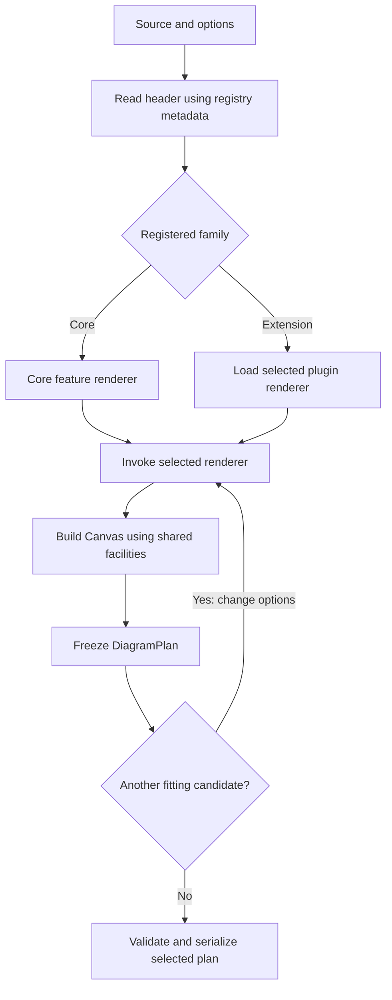

# Proposed architecture: core workflow and diagram plugins

Status: implemented. The current ownership and APIs are documented in
[architecture](architecture.md) and [plugin authoring](plugins.md). This document
records the design and migration rationale. Subsequent user decisions removed
obsolete internal compatibility shims, retained only the documented styled-output
re-export, and added typed option inheritance and native-protocol adapters.

The confirmed priorities are fewer files to navigate per feature, clear duties
for each module, shared workflow and utilities, unified Graph/Canvas contracts,
and an extension boundary for less central diagram types.

## Architecture decision

Use three cooperating parts:

1. **Shared foundations:** graph and canvas models, rendering contracts, layout,
   routing, drawing primitives, fitting, and output serialization.
2. **Core diagram features:** each owns its syntax, domain model, and family
   workflow, using the shared foundations where appropriate.
3. **Diagram plugins:** additional families use the same rendering contract and
   output pipeline. Existing extensions remain bundled during migration.

A diagram feature should normally live in one module. Keep its small data
classes, parser, and rendering entry point together. A large feature can use a
small package with explicitly named duties. Shared algorithms stay shared;
feature-specific policies stay with their feature. Avoid parallel global
`model/`, `parser/`, and `renderer/` files for every small diagram type.

The confirmed starting core is flowchart, state, sequence, class, and ER.
Core membership must also consider semantic similarity and how naturally a
family enters the shared workflow. Based on the existing implementation,
architecture diagrams are recommended as an additional core family. This is
an architectural recommendation, not a measurement of usage frequency.
Other existing families remain available through bundled plugins. Packaging
plugins separately is a later decision, not a prerequisite for this refactor.

## Deciding core membership

Assess each family using these criteria together:

1. **Model compatibility:** can it use Graph or another established model without
   losing its semantics or adding diagram-specific fields throughout the core?
2. **Algorithm reuse:** does it use existing placement, routing, drawing and label
   behavior, or require a substantially different execution model?
3. **Entry cost:** can a parser and a thin call into shared rendering handle it,
   with no diagram-specific conditionals in the dispatcher, fitter or outputs?
4. **Dependency and maintenance cost:** does inclusion preserve a lightweight
   core with a clear owner, bounded complexity and testable contracts?
5. **Product importance:** is it part of the explicitly prioritized feature set?

Similarity means shared semantics and implementation, not merely similar-looking
boxes or arrows. Easy registration alone is insufficient: every plugin should
be easy to register. Low ongoing adaptation cost is the stronger core signal.

| Family | Verified integration characteristics | Proposed placement |
| --- | --- | --- |
| Flowchart, state | Both parse into Graph and use the shared graph layout and renderer | Core: foundational workflow |
| Architecture | Already produces Graph with port hints and precomputed grid positions; calls the same graph renderer | Core: recommended addition because reuse is already implemented |
| Sequence | Has an event/lifeline model and specialized layout; shares cells and label planning | Core: confirmed priority, with its own coherent workflow |
| Class, ER | Separate models and layered box/relationship renderers; similar domain patterns, but neither currently uses the common Graph renderer | Core: confirmed priority; share proven primitives without forcing a model conversion |
| Block | Uses its own grid/span model and placement; shares shape drawing | Bundled plugin initially; reassess if a broadly reusable grid workflow emerges |
| Git | Commit/branch semantics and specialized history placement | Bundled plugin |
| Packet | Bit ranges and row layout | Bundled plugin |
| Charts, timelines, boards, trees | Family-specific models and placement; reuse terminal drawing and output contracts | Bundled plugins, grouped by genuine shared responsibilities |

Revisit placement when a common workflow becomes established. A registry entry
and stable identifier should remain valid when a bundled plugin is promoted to
core. Plugin status is an ownership/loading boundary, not reduced rendering
quality or a different output format.

## Current problems this addresses

The working tree contains 71 Python modules and about 17,600 lines.

| Observed problem | Proposed correction |
| --- | --- |
| Most families span global model/parser/renderer directories plus a strategy class | Co-locate family code and register its rendering entry point directly |
| Seventeen strategy classes mostly forward configuration | Use one typed renderer contract; use concrete classes only when state or lifecycle needs them |
| `GraphRenderer` calls back into public `termaid.parse()` | Select the parser inside the feature and call shared graph rendering directly |
| Dispatch, output-plan data, and optional adapters depend on each other's locations | Separate foundational contracts from orchestration and serialization |
| CLI fitting depends on argparse, terminal state, and diagnostic emission | Keep fitting policy in a reusable module with explicit inputs and results |
| `Canvas` is an alias of `LayoutScene`, while both names appear in production paths | Establish one canonical canvas implementation and compatibility aliases |
| Several output entry points also perform layout | Make the canonical output adapters consume completed plans |
| Graph drawing, routing, and sequence rendering each exceed 1,100 lines | Expose their stages first; split only where an independent duty reduces navigation |
| The architecture guide has 887 lines, including performance history and integrations | Keep the current architecture short and link to task-specific references |

## Proposed ownership map

```text
src/termaid/
├── __init__.py              # Public exports and convenience API
├── pipeline.py              # Classify, resolve, invoke, freeze; public plan()
├── source.py                # Read preamble and header; classify with registry
├── registry.py              # Diagram descriptors, aliases, lazy loading
├── cli.py                   # Arguments, terminal policy, I/O, diagnostics
├── ingest.py                # Structured input → Mermaid
├── diagnostics.py           # Stable diagnostic schema and presentation
├── core/
│   ├── graph.py             # Graph, Node, Edge, Subgraph, shapes and directions
│   ├── canvas.py            # Canvas, immutable DiagramPlan, cell/style storage
│   └── contracts.py         # Source, options, result, Renderer, DiagramDefinition
├── diagrams/                # Core features
│   ├── flowchart.py         # Flowchart syntax + shared graph rendering entry
│   ├── state.py             # State syntax + shared graph rendering entry
│   ├── architecture.py      # Recommended core addition; reuses Graph workflow
│   ├── sequence/            # Larger feature: syntax.py and render.py initially
│   ├── classdiagram.py      # Class model, parsing, layout and drawing
│   └── erdiagram.py         # ER model, parsing, layout and drawing
├── plugins/                 # Bundled feature implementations
│   ├── gitgraph.py
│   ├── block.py
│   ├── packet.py
│   ├── charts.py            # Pie, quadrant, XY; related implementations together
│   ├── timelines.py         # Gantt and timeline
│   ├── boards.py            # Journey and kanban
│   └── trees.py             # Mindmap and treemap
├── layout/                  # Shared geometry, placement and label reservations
│   ├── fitting.py           # Candidate generation, scoring, selection
│   └── ...                 # Existing graph placement and geometry stages
├── routing/                 # Shared ports, path search and route refinement
├── renderer/                # Shared drawing, rather than one adapter per type
│   ├── graph.py             # Graph geometry → canvas
│   ├── shapes.py            # Reusable shape drawing
│   └── charset.py           # ASCII/Unicode drawing characters
├── output/                  # Plan → text/Rich/styled JSON; optional UI consumer
└── utils.py                 # Shared display-width and text-wrapping primitives
```

This is a responsibility map, not an instruction to move everything at once.
Existing compatibility modules are omitted. Sequence begins with two local
files because combining its model, parser, and renderer would exceed 1,400
lines. Split its rendering further only if a distinct stage is easier to change
independently. Apply the same reasoning to other large modules; line count alone
does not justify another file. Related plugins can share a module without
sharing the same layout algorithm.

## Shared contracts and dependencies

The foundational vocabulary is small:

| Contract | Duty |
| --- | --- |
| `Graph` | Semantic graph nodes, edges, groups and styles; used where the diagram is graph-shaped |
| `Canvas` | Mutable terminal cells, occupancy and drawing operations; the canonical name for today's `LayoutScene` |
| `DiagramPlan` | Immutable completed cells and styles; reused by every output format |
| `ParsedSource` | Stable diagram identifier, complete normalized text, and header/body text |
| `RenderConfig` | Immutable common rendering options with existing family defaults preserved |
| `RenderResult` | Canvas and style information needed to freeze a plan; preserve graph-specific style behavior |
| `Renderer` | Typed callable taking `ParsedSource` and `RenderConfig`, returning `RenderResult` |
| `DiagramDefinition` | Identifier, exact header aliases, contract version, and lazy renderer loader |

One protocol can express the renderer callable. A function, bound method, or
stateful implementation may satisfy it. The default for a simple family is a
function in that family's module. Do not require a subclass, factory class, and
adapter class for every type.

Flowchart, state, and architecture share Graph layout/routing/drawing. Sequence,
charts, and other specialized families keep suitable domain models and reuse
Canvas, label primitives, options, fitting, and serialization. Sharing a canvas
does not require turning every diagram into a Graph.

Core data contracts must not import the registry, pipeline, CLI, or feature
implementations. Feature implementations import contracts and shared algorithms,
never the public package facade. Shared layout/drawing modules do not depend on
specific plugin implementations. Serializers do not dispatch or lay out diagrams.
Existing `DiagramPlan.to_rich()` and `to_styled()` convenience methods can retain
lazy serializer calls; these are explicit serialization-only boundary methods.

## Plugin behavior

The current closed `DiagramType` enum cannot represent a third-party family
without editing core code. Before publishing the uncommitted classifier API,
use an extensible, validated string identifier in the canonical `ParsedSource`
contract. Built-in enum names can remain convenience aliases at the boundary.
Identifiers for external families should be namespaced to avoid ambiguity.

Put built-in and bundled-plugin descriptors in one registry manifest. Descriptor
metadata supplies identifiers, header aliases and lazy loaders; detection does
not import every implementation. Core and plugin entries use exactly the same
lookup and rendering path. The header parser must obtain known aliases from this
registry, rather than maintain a second hard-coded list of supported types.

The first extension mechanism is explicit registration of a typed descriptor.
A caller can supply a registry to classification/planning; the default registry
contains the core and all currently supported bundled plugins. Package discovery
can be added later as a small adapter, after the descriptor contract is stable.
There is no need for downloads, plugin management commands, or separate package
releases to establish this architecture.

Resolve these rules in the initial contract:

- Reject duplicate identifiers and ambiguous header aliases. Plugins do not
  silently replace a core family based on registration order.
- Preserve directives in complete source text. Git consumes that text; families
  that require the header first use the body. The dispatcher has no Git branch.
- Detect the exact first diagram header after the preamble; configuration and
  labels must not select a family.
- Freeze the effective registry for one render/fitting operation. Preclassified
  input must resolve against that registry; missing registrations fail clearly.
- Distinguish an unrecognized header from a recognized but unavailable plugin.
  Preserve the current permissive flowchart fallback for the former; report the
  latter explicitly instead of silently rendering it as a flowchart.
- Version the plugin contract. Report incompatible contracts or missing optional
  dependencies at plugin loading, without breaking unrelated core diagrams.
- Keep rendering dependencies lazy. Test that core rendering does not import
  bundled plugin implementations, Rich, or Textual.
- Keep existing family support installed and enabled throughout migration.
  A later minimal distribution can make selected plugins optional explicitly.

## Proposed workflow



The fitting back edge represents invoking the already selected renderer again
with the same classified source and new options. Do not repeat classification
or plugin discovery on every attempt. Individual family models may still be
parsed per attempt; safe model reuse requires an ownership/copying audit.

A direct `plan()` call produces one plan. The CLI optionally applies fitting,
checks strict width/height rules, and serializes only the chosen plan. Terminal
detection and warnings belong to the CLI; candidate policy and scores belong to
`layout/fitting.py`. Retain compact/wrap/reflow behavior and the current maximum
of eight rendering attempts. Constraint failures must still precede file writes.

Within graph rendering, preserve the existing sequence:

```text
parse → place/size → route/orient → paint geometry
      → place labels against occupied cells → freeze cells
```

Keep routing-refinement order and occupancy-sensitive label placement intact
while moving code. A structural refactor must not quietly change those policies.

## Migration plan

1. **Baseline and contract.** Capture the current working tree separately from
   HEAD, including uncommitted changes. Inventory public and documented low-level
   imports; record family defaults, output snapshots, fitting bounds, diagnostics,
   and representative timings. Apply the core-membership criteria, including
   architecture's existing Graph integration. Specify the shared
   renderer and registry contracts before moving implementations.
2. **Establish the common pipeline.** Move unified definitions into `core/`,
   extract registry-driven classification, and introduce `pipeline.py`. Keep
   public `parse`, `plan`, `render`, and `render_rich` behavior. Replace strategy
   forwarding classes with direct family callables, initially pointing to the
   existing implementations. Remove callbacks into the public facade.
3. **Pilot two complete feature moves.** Co-locate packet and Git as bundled
   plugins: packet exercises width fitting and Git exercises directives. Update
   imports and tests together; retain narrow compatibility exports where needed.
   Review the number of files needed for a real feature edit before repeating
   the pattern. A new family should need its implementation plus one descriptor,
   with no edits to the pipeline, fitter, or output adapters.
4. **Migrate remaining families.** Move core features into `diagrams/` and other
   families into `plugins/`. Keep related small families grouped and substantial
   features in cohesive local modules/packages. Shared graph drawing, shapes,
   routing, label occupancy and text utilities remain common facilities. Avoid
   speculative helpers and extra files for constants or forwarding methods.
5. **Unify fitting and output.** Move CLI fitting into its shared module with
   explicit immutable options and returned scores. Canonical serializers accept
   completed plans; legacy graph-taking APIs delegate through shared rendering.
   Preserve Rich custom styles, section backgrounds, and trailing-space policy.
   Stop internal imports through Canvas/engine compatibility aliases.
6. **Finish navigation and checks.** Put named stage functions in the large
   routing/drawing modules; extract a file only when it reduces the navigation
   needed for a distinct task. Replace the long architecture narrative with the
   ownership map, workflow, plugin contract and a small feature example. Link
   separate integration examples and benchmark history. Add import-boundary and
   registry contract tests so the boundaries remain clear.

Each step should be independently reviewable. Keep feature work, routing
heuristic changes, dependency upgrades, separate plugin packaging, and model
caching out of these structural changes. Keep compatibility shims until their
removal is justified by the supported API policy, rather than deleting paths
merely because in-repository imports have moved.

## Completion criteria

- Each feature has one obvious home; simple syntax and rendering changes do not
  require navigating parallel global model/parser/renderer trees.
- Core workflows are readable without opening optional diagram implementations.
- New plugins require an implementation and registration, without modifying core
  type enums or adding dispatch conditionals.
- The same Canvas, renderer contract, DiagramPlan, fitting and serializers serve
  core and plugin diagrams; family-specific models remain accurately typed.
- All existing families, options, directives, Unicode/ASCII behavior, styles,
  diagnostics and version-1 JSON outputs retain their contracts.
- Tests cover registration collisions, unknown/unavailable types, lazy imports,
  registry consistency across fitting, directive preservation, family isolation,
  and serialization without layout.
- Run focused tests for each migrated feature, then the normal full pytest suite,
  compileall, and diff checks. Do not update snapshots merely to pass a move.
- No static checker or linter is configured today. Perform the required AST
  parameter-rebinding audit on touched modules and adjacent boundaries; establish
  checker coverage for shared contracts explicitly rather than masking errors
  with Any, casts, ignores, or broad annotations.
- Compare cold imports, rendering and memory benchmarks after boundary changes.
  Investigate repeatable regressions before accepting the migration.

The shared workflow, feature ownership, bundled plugin registry and explicit
protocol adapters are implemented. External package discovery and separate
plugin distributions remain future work.
