# Supported Mermaid definitions

Termaid currently renders the 18 diagram types below. Each `text` block shows
copyable native Mermaid source. The identical `mermaid` block beneath it lets
Neovim show the rendered result. Save the source as a `.mmd` file or pass it to
`termaid` on standard input. See [project architecture](architecture.md) for
the parser, model, and renderer call paths.

## Shared `Graph` model

These three parsers produce `Graph` and use the shared graph placement,
orthogonal routing, and drawing path.

### Flowchart

Nodes, labeled connections, shapes, and nested subgraphs form a directed graph.

```text
flowchart LR
  Client --> API
  subgraph Backend [Backend]
    API -->|write| Store[(Store)]
  end
```

Rendered preview:

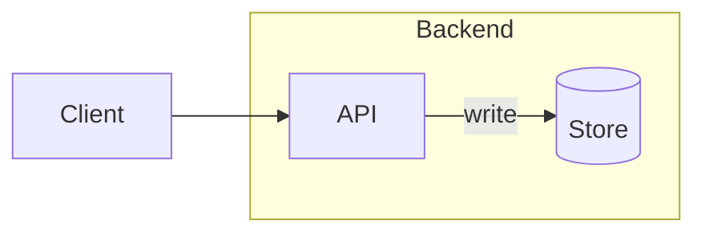

### State diagram

States and labeled transitions use the graph renderer, including start and end
markers.

```text
stateDiagram-v2
  [*] --> Idle
  Idle --> Running: start
  Running --> [*]: finish
```

Rendered preview:

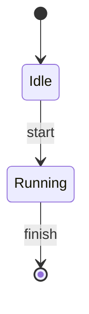

### Architecture diagram

Services, groups, junctions, and port directions become graph nodes, subgraphs,
and connections with declared grid positions.

```text
architecture-beta
  group api(cloud)[API]
  service gateway(server)[Gateway] in api
  service db(database)[Database] in api
  gateway:R --> L:db
```

Rendered preview:

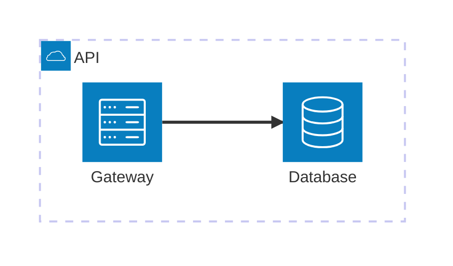

## Relationships and interactions

### Sequence diagram

Participants exchange ordered messages along lifelines; notes, activation,
and control blocks use the same event layout.

```text
sequenceDiagram
  participant Alice
  participant Bob
  Alice->>Bob: Request
  Bob-->>Alice: Reply
```

Rendered preview:

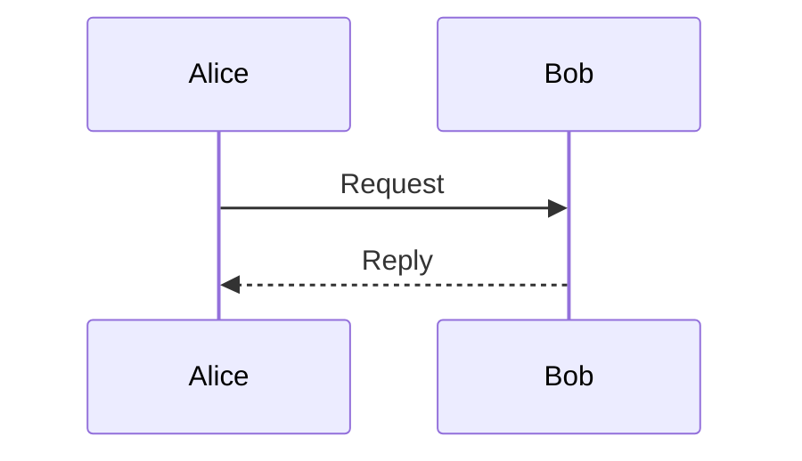

### Class diagram

Class compartments hold attributes and methods; relationship markers connect
the class boxes.

```text
classDiagram
  class Animal {
    +String name
    +speak()
  }
  class Dog
  Animal <|-- Dog
```

Rendered preview:

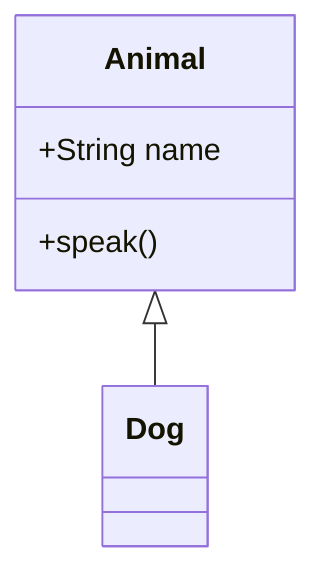

### Entity relationship diagram

Entities can declare typed attributes; relationships carry cardinality and
optional labels.

```text
erDiagram
  CUSTOMER ||--o{ ORDER : places
  CUSTOMER {
    int id PK
  }
```

Rendered preview:

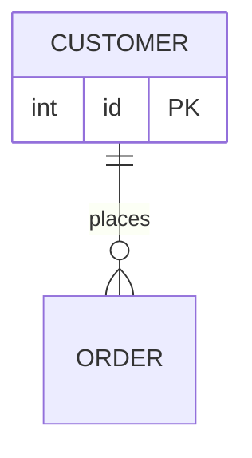

## Grids, lanes, and ordered work

Each type in this section has its own model and placement rules, even when two
renderers live in the same Python module.

### Block diagram

Explicit columns and spans place blocks on a grid; blocks can also have links
and nested groups.

```text
block-beta
  columns 2
  A["Input"] B["Output"]
  A --> B
```

Rendered preview:

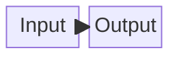

### Git graph

Branch and commit commands produce lanes with fork and merge connections.

```text
gitGraph
  commit id: "init"
  branch feature
  checkout feature
  commit id: "work"
  checkout main
  merge feature
```

Rendered preview:

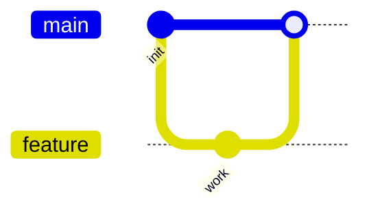

### Gantt chart

Dated tasks become rows and bars on a date axis; task tags control milestone,
active, done, and critical marks.

```text
gantt
  dateFormat YYYY-MM-DD
  section Build
  Design :done, d1, 2024-01-01, 3d
  Review :d2, after d1, 2d
```

Rendered preview:

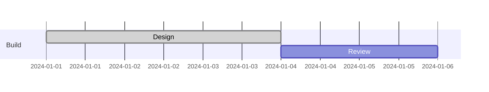

### Timeline

Sections and events become ordered text rows beside a vertical spine.

```text
timeline
  title Roadmap
  2024 : Plan
  2025 : Release
```

Rendered preview:

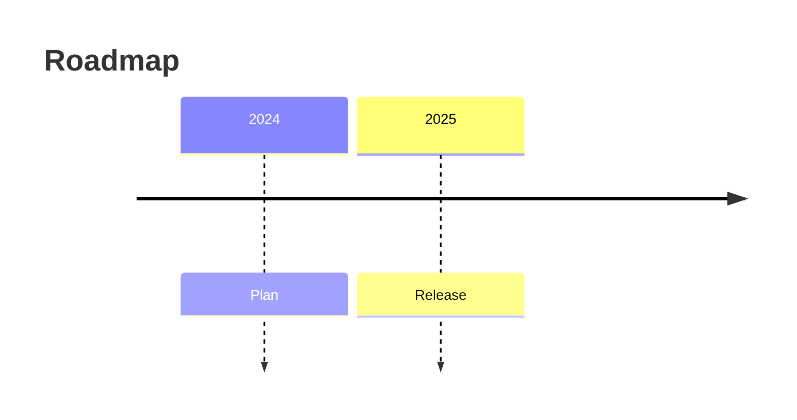

### User journey

Sectioned tasks carry satisfaction scores and actor names along a horizontal
path.

```text
journey
  title Release
  section Build
    Implement: 4: Alice, Bob
  section Ship
    Deploy: 5: Bob
```

Rendered preview:

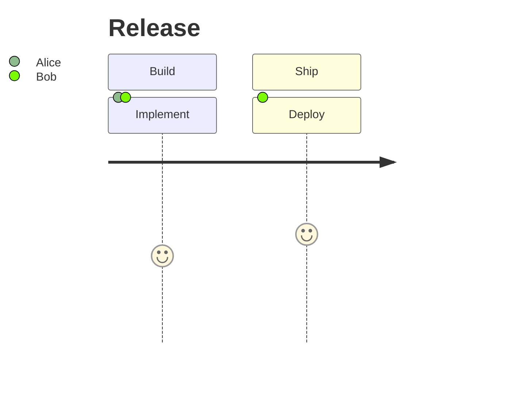

### Kanban board

Indentation places cards under columns; cards can carry metadata.

```text
kanban
  Todo
    Design
  Doing
    Build
```

Rendered preview:

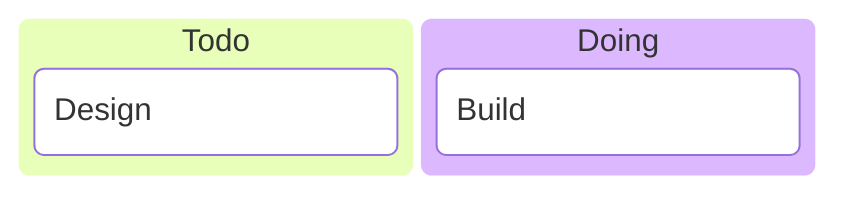

### Packet diagram

Bit ranges place fields in aligned rows with boundary numbers and field labels.

```text
packet-beta
  0-15: "Source"
  16-31: "Destination"
```

Rendered preview:

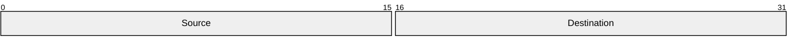

## Charts and trees

### Pie chart

Labeled positive values become proportional terminal bars and percentages;
`showData` also prints raw values.

```text
pie showData
  title Tasks
  "Done": 60
  "Open": 40
```

Rendered preview:

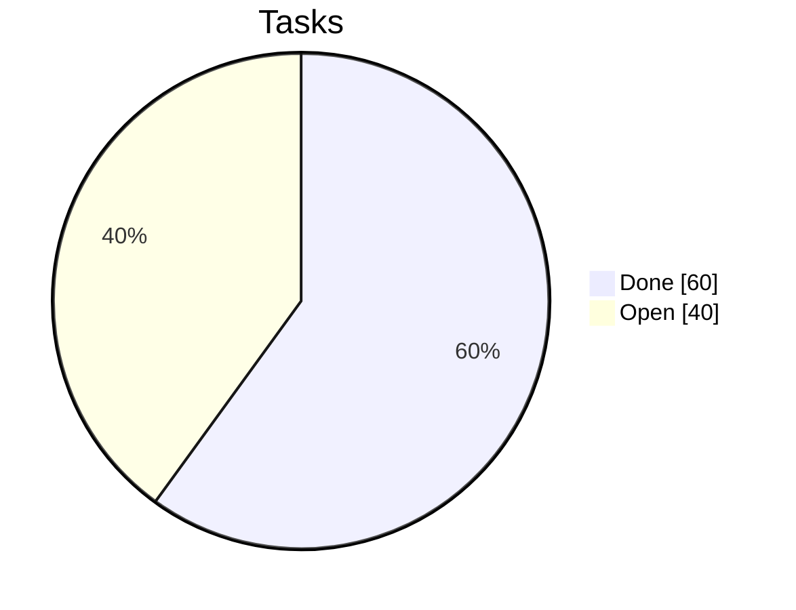

### Quadrant chart

Points use normalized coordinates within four labeled quadrants.

```text
quadrantChart
  x-axis Low --> High
  y-axis Low --> High
  Plan: [0.2, 0.8]
  Ship: [0.8, 0.2]
```

Rendered preview:

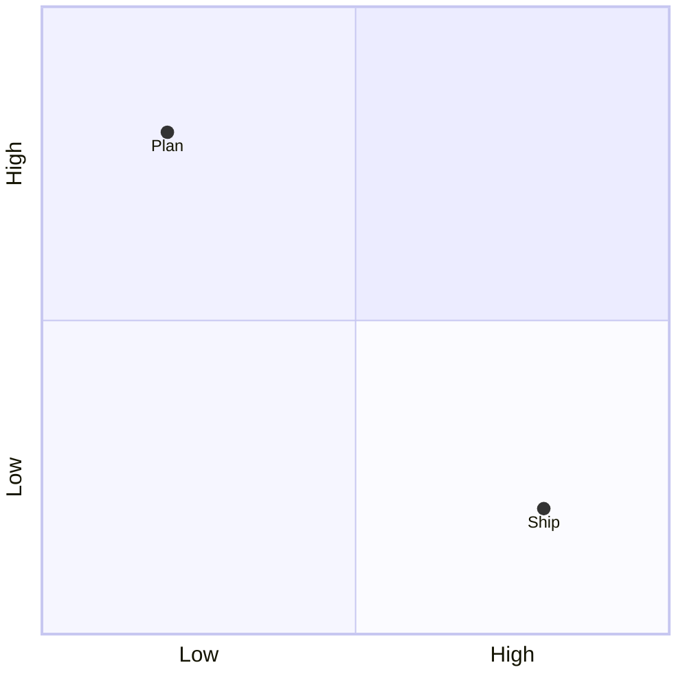

### XY chart

Categories, numeric axes, and bar or line datasets become a scaled terminal
chart.

```text
xychart-beta
  title "Weekly work"
  x-axis [Mon, Tue, Wed]
  y-axis 0 --> 10
  bar [3, 7, 5]
```

Rendered preview:

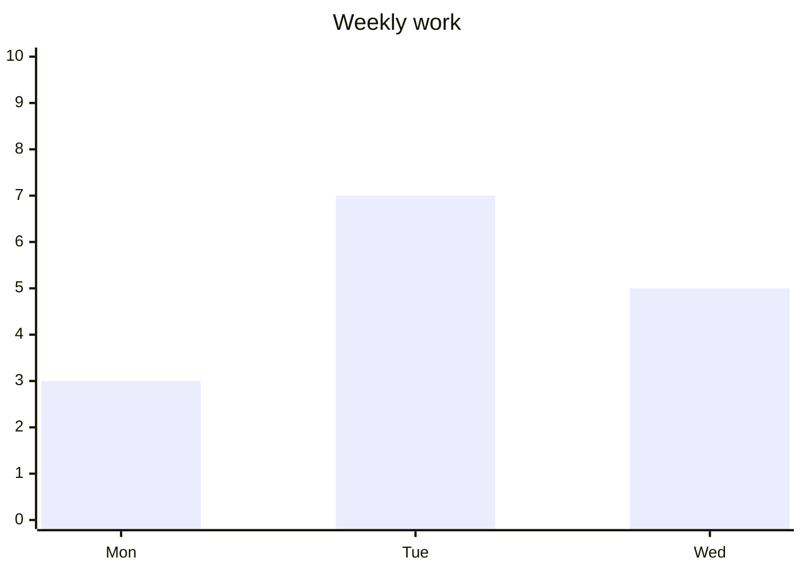

### Mindmap

Indentation creates a rooted tree; branches are arranged recursively around
the root.

```text
mindmap
  root((Project))
    Plan
    Build
```

Rendered preview:

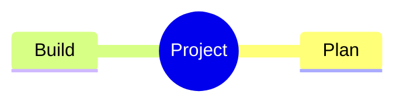

### Treemap

Indented sections and numeric leaves become nested rectangles sized by value.

```text
treemap-beta
  "Project"
    "Code": 60
    "Tests": 40
```

Rendered preview:

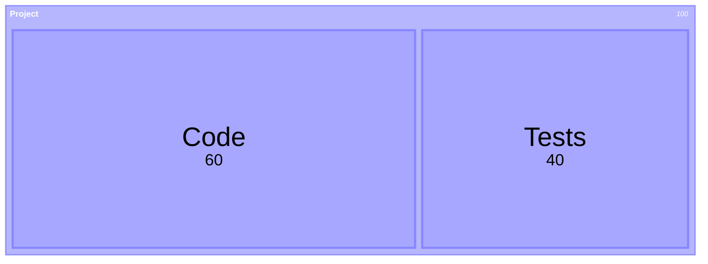
